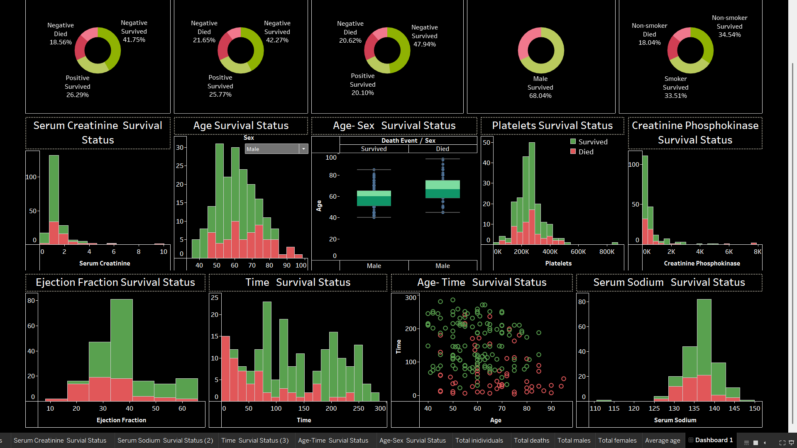

# 🏥 Healthcare Analysis

## Overview
This project delves into healthcare data to uncover trends and patterns that can aid in improving patient care and resource allocation. The interactive dashboard provides insights into patient demographics, health metrics, and risk factors, enabling stakeholders to make data-driven decisions for better healthcare management.

**[🌐 View Dashboard on Tableau Public](https://public.tableau.com/app/profile/dharmik.shah2873/viz/HealthCare_Analysis/Dashboard1?publish=yes)**

---

## Key Features
- **Interactive Filters**: Explore healthcare data by demographics, clinical metrics, and outcomes.
- **Health Metric Analysis**:
  - Trends in critical health indicators (e.g., age, serum creatinine, ejection fraction).
  - Distribution of high-risk patients by metrics and conditions.
- **Dynamic Visuals**:
  - Patient outcome trends across demographics and conditions.
  - Risk factor heatmaps.
  - Comparison of health conditions and their frequency.

---

## Repository Contents
- 📂 **Dataset**: `Dataset/heart_failure_clinical_records_dataset.csv`
- 📂 **Presentation**: `Presentation/Hearthfailure and prediction.pdf`
- 📂 **Images**: `Images/`

---

## Insights from the Dashboard
- 🩺 **Patient Demographics**: Key insights into age groups and gender distribution in the dataset.
- 📈 **Critical Risk Factors**: Serum creatinine and ejection fraction levels are significant predictors of patient outcomes.
- 🔍 **Outcome Trends**: Identifies patterns in patient follow-ups and survival outcomes.
- 🌟 **Actionable Insights**: Targeted intervention for high-risk groups based on health indicators, improving resource optimization and patient care.

---

## Tools Used
- **Tableau**: Dashboard creation and visualization.
- **Python**: Data cleaning and preprocessing.

---

## How to Use
1. **View the Dashboard**:
   - Access the interactive dashboard directly on [Tableau Public](https://public.tableau.com/app/profile/dharmik.shah2873/viz/HealthCare_Analysis/Dashboard1?publish=yes).
2. **Explore Locally**:
   - Clone this repository:
     ```bash
     git clone https://github.com/your-repo-name.git
     ```
   - Use the provided dataset (`dataset/heart_failure_clinical_records_dataset.csv`) for further analysis.

---

## Visual Preview

### 📊 Dashboard Overview


---

## License
This project is licensed under [MIT License](LICENSE).

---

## Connect
For any questions or suggestions, feel free to reach out!

- **Author**: Dharmik Shah
- **GitHub**: [dharmik2101](https://github.com/dharmik2101)
- **Tableau Public**: [Dharmik Shah](https://public.tableau.com/app/profile/dharmik.shah2873)
